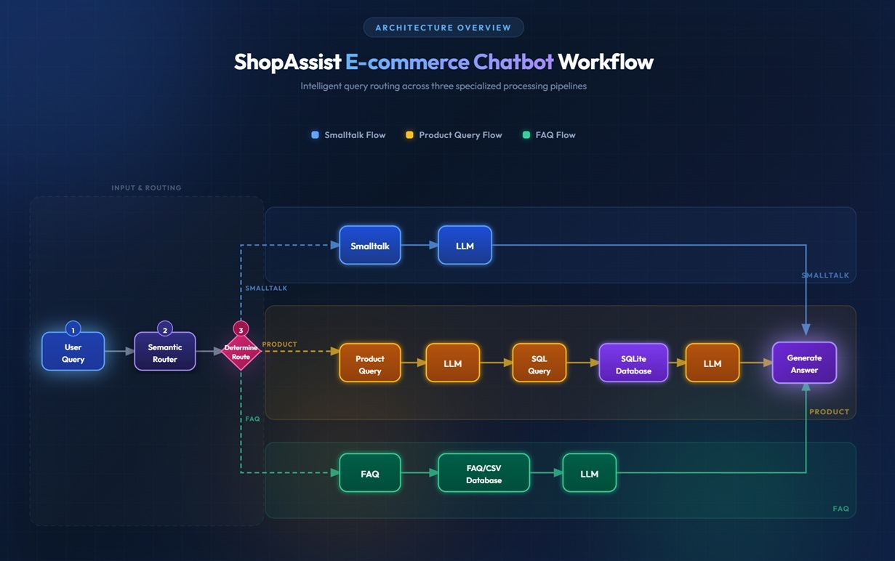

# ShopAssist Gen AI Chatbot
The ShopAssist GenAI Chatbot is an intelligent conversational assistant designed to enhance the online shopping experience by helping users quickly find information, explore products, and interact naturally with an e-commerce platform.

At the core of the system is a semantic routing architecture that analyzes each user query and directs it to the most appropriate processing module. This routing mechanism ensures that the chatbot responds efficiently and accurately depending on the intent of the user.
The chatbot is built around a multi-route conversational framework consisting of three primary routes:

##### Small Talk Route: 
  Handles casual interactions such as greetings and general conversation, creating a more engaging and human-like user experience.

##### FAQ Route: 
  Provides quick and reliable answers to common customer questions using a structured knowledge base.

##### Product Query Route: 
  Enables users to search for products through natural language queries.

### ▶️ Live Demo
  https://shop-assist-gen-ai-chatbot.streamlit.app
        
  

## 🧠 Architecture Diagram

## ✨ Features

##### 💬 Intelligent Intent Detection
  Analyzes user queries and routes them to the correct processing module.
##### 🛍️ E-Commerce Product Discovery
  Users can search for products using natural language and receive relevant product details along with direct Etsy product URLs.
##### 📚 FAQ Assistance
  Provides quick responses to commonly asked questions from a structured knowledge base.
##### 🧠 Context-Aware Conversational Responses
  Uses AI models to generate natural and relevant responses.
##### 🔄 Semantic Routing Architecture
  Efficiently directs queries to specialized handlers such as SweetTalk, FAQ, or Product Search.
##### 📦 Modular & Extensible Design
  Built with Python and modern AI libraries, making it easy to expand with new capabilities.

## ⚙️ Installation
#### 1️⃣ Clone the repository
      git clone https://github.com/SanehLata/ShopAssist_GenAIChatbot.git
      cd ShopAssist_GenAIChatbot
#### 2️⃣ Create virtual environment
      python -m venv venv

      Activate environment:
            Windows:
                venv\Scripts\activate
            Mac/Linux:
              source venv/bin/activate
#### 3️⃣ Install dependencies
      pip install -r requirements.txt
#### 4️⃣ Run the chatbot
      streamlit run app/main.py

      Open browser
      http://localhost:8501

## 🛠️ Tech Stack

| Category        | Technology                        |
| --------------- | --------------------------------- |
| Language        | Python 3.10                       |
| Frontend        | Streamlit                         |
| AI Model        | Groq llama-3.1-8b-instant     |
| Embeddings Model| Hugging Face Mini LM (all-MiniLM-L6-v2)                         |
| Intent Routing  | Semantic Router                   |
| Data            | Product Dataset                   |
| Database        | SQLite                            |
| Deployment      | Streamlit Cloud                   |
| Version Control | Git + GitHub                      |

