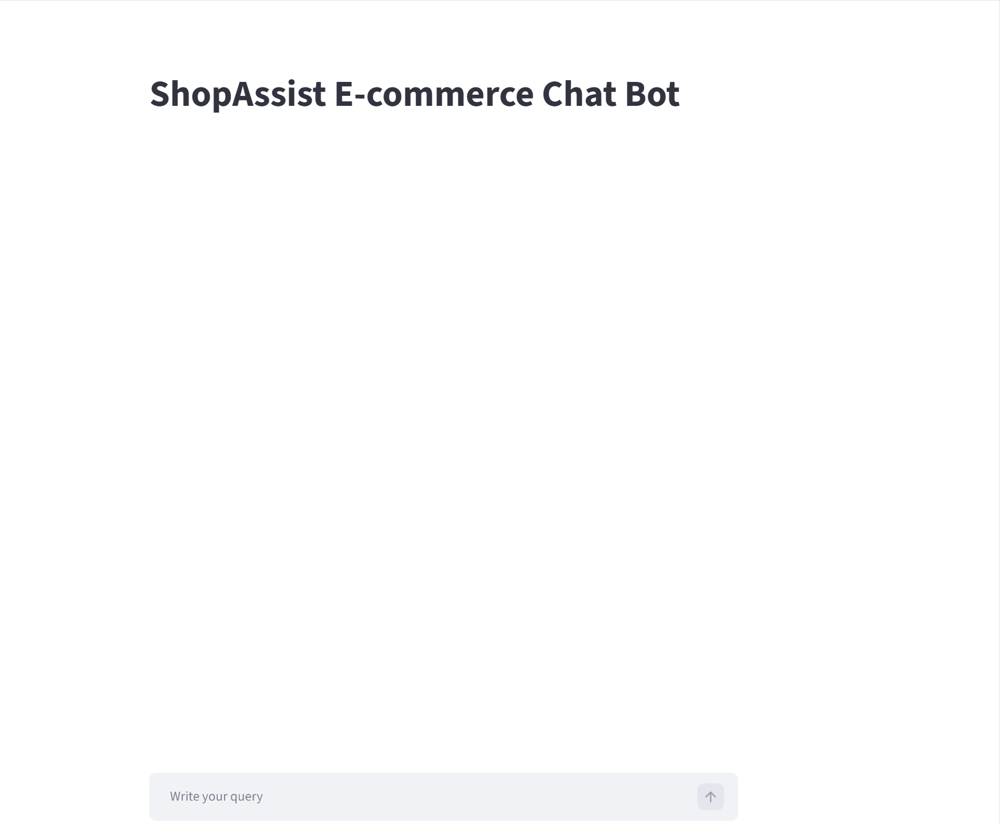
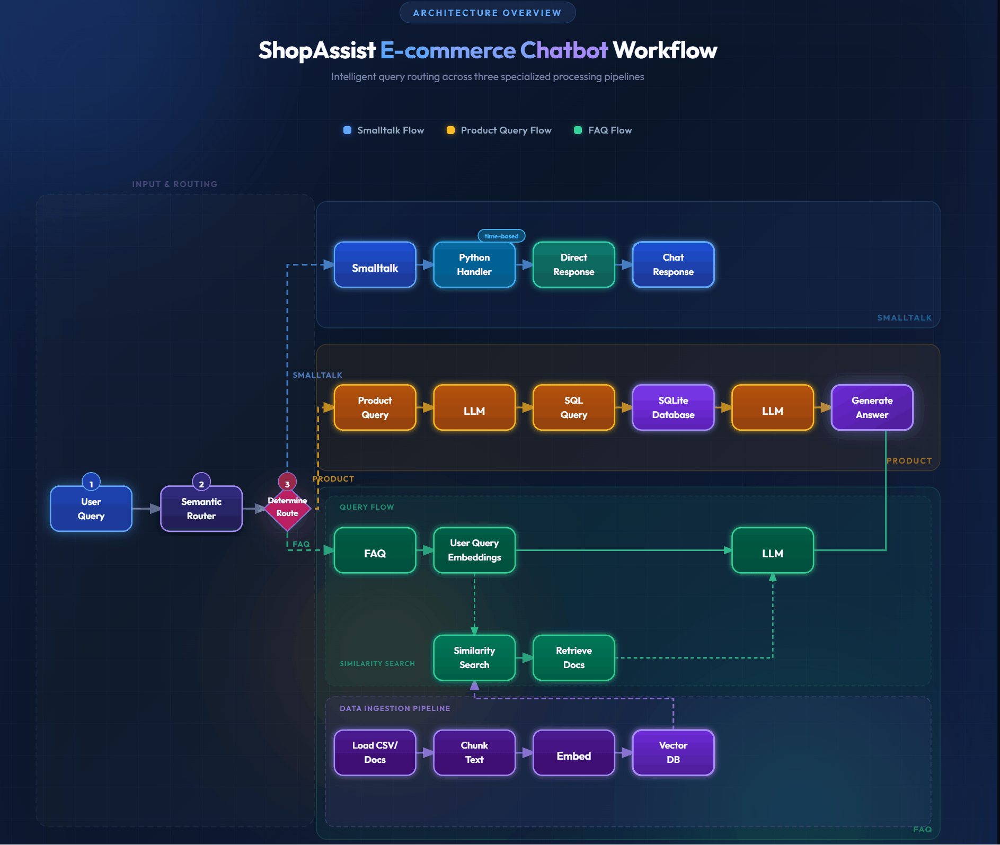

# ShopAssist Gen AI Chatbot
The ShopAssist GenAI Chatbot is an intelligent conversational assistant designed to enhance the online shopping experience by helping users quickly find information, explore products, and interact naturally with an e-commerce platform.

At the core of the system is a semantic routing architecture that analyzes each user query and directs it to the most appropriate processing module. This routing mechanism ensures that the chatbot responds efficiently and accurately depending on the intent of the user.
The chatbot is built around a multi-route conversational framework consisting of three primary routes:

##### Small Talk Route: 
  Handles casual interactions such as greetings and general conversation, creating a more engaging and human-like user experience.

##### FAQ Route: 
  Provides quick and reliable answers to common customer questions using a structured knowledge base.

##### Product Query Route: 
  Enables users to search for products through natural language queries.

## ▶️ Recorded Demo

  

## ▶️ Live Application
  https://shop-assist-gen-ai-chatbot.streamlit.app
        

## 💻 Business Value and Measurable Impact

## 🧠 Architecture Diagram

## ✨ Features

##### 💬 Intelligent Intent Detection
  Analyzes user queries and routes them to the correct processing module.
##### 🛍️ E-Commerce Product Discovery
  Users can search for products using natural language and receive relevant product details along with direct Etsy product URLs.
##### 📚 FAQ Assistance
  Provides quick responses to commonly asked questions from a structured knowledge base.
##### 🧠 Context-Aware Conversational Responses
  Uses AI models to generate natural and relevant responses.
##### 🔄 Semantic Routing Architecture
  Efficiently directs queries to specialized handlers such as SweetTalk, FAQ, or Product Search.
##### 📦 Modular & Extensible Design
  Built with Python and modern AI libraries, making it easy to expand with new capabilities.

## ⚙️ Installation
#### 1️⃣ Clone the repository
      git clone https://github.com/SanehLata/ShopAssist_GenAIChatbot.git
      cd ShopAssist_GenAIChatbot
#### 2️⃣ Create virtual environment
      python -m venv venv

      Activate environment:
            Windows:
                venv\Scripts\activate
            Mac/Linux:
              source venv/bin/activate
#### 3️⃣ Install dependencies
      pip install -r requirements.txt
#### 4️⃣ Run the chatbot
      streamlit run app/main.py

      Open browser
      http://localhost:8501

## 🛠️ Tech Stack

| Category        | Technology                        |
| --------------- | --------------------------------- |
| Language        | Python 3.10                       |
| Frontend        | Streamlit                         |
| AI Model        | Groq llama-3.1-8b-instant     |
| Embeddings Model| Hugging Face Mini LM (all-MiniLM-L6-v2)                         |
| Intent Routing  | Semantic Router                   |
| Data            | Product Dataset                   |
| Database        | SQLite                            |
| Deployment      | Streamlit Cloud                   |
| Version Control | Git + GitHub                      |

## 💡 Use cases in IT industry

The same architecture (Semantic Routing + NL→SQL + Vector FAQ) is highly reusable for other strong IT use cases:

### 🛠️ IT Operations & Support
#### 1. Internal IT Helpdesk Bot
Handles natural language questions like:

    "How do I reset my VPN?"
    
    "My laptop won't connect to Wi-Fi" 
  
  The bot routes to FAQs, troubleshooting guides, or raises a ticket automatically.
#### 2. Incident Management Assistant
Query past incidents naturally: 

      "Show me all P1 incidents in the last 30 days related to the payment service" 
    
  NL→SQL hits your incident database and returns structured results.
#### 3. On-Call Runbook Assistant
Engineers on call ask 

      "What's the recovery steps for database failover?" 
      
The bot retrieves the right runbook section via vector search, saving critical minutes during outages.

### ☁️ DevOps & Infrastructure
#### 1. Cloud Cost Assistant
Handles queries like :

       "Which AWS services cost the most last month?"
       
       "Compare EC2 spend across dev and prod"
       
NL→SQL against cost/billing data from AWS Cost Explorer exports.

#### 2. CI/CD Pipeline Assistant
Queries your pipeline metadata database naturally:

      "Show me all failed deployments to production this week" 
      
      "Which microservice has the most flaky tests?" 
      
  
#### 3. Infrastructure Inventory Bot
Natural language querying of your CMDB or cloud inventory.

      "List all EC2 instances running in us-east-1 above 80% CPU".

### 📋 Knowledge & Documentation
#### 1. Internal Developer Portal Bot
New joiners asks:

      "How do I set up the local dev environment?"
      
      "What's the PR review process?" 
      
  Vector search over your onboarding docs, Confluence, Sharepoint, wikis, and READMEs etc.
  
#### 2. API Documentation Assistant
Developers ask "How do I authenticate with the payments API?"

      "What does error code 4023 mean?" 
      
Semantic search over API docs and OpenAPI specs.

#### 3. Post-Mortem / RCA Knowledge Base

      "Have we seen this kind of memory leak before?"
      
Searches past post-mortems semantically, helping teams avoid repeating past mistakes.

### 📊 Data & Analytics
#### 1. Business Intelligence Chatbot
Non-technical stakeholders ask 

      "How many users signed up last quarter?" 
      
NL→SQL against your data warehouse, no SQL knowledge needed or technical support team needed.

#### 2. Log Analysis Assistant

      "Show errors from the checkout service between 2pm and 3pm yesterday"
      
NL→SQL or NL→query against structured log data in tools like Elasticsearch or BigQuery.
